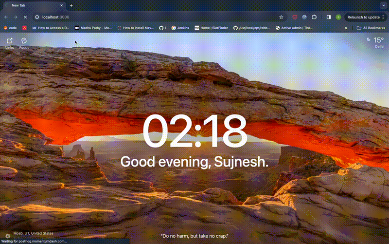

To set up the project locally, follow these steps:

1. **Ensure Rails Version**: The project uses Rails version `~> 5.2`. Ensure you have the correct Rails version installed. If not, you might need to install it using the command:
   ```bash
   gem install rails -v '~> 5.2'
   ```

2. **Clone the Repository**: Clone the project repository to your local machine using the Git command:
   ```bash
   git clone <repository-url>
   ```

3. **Install Dependencies**: Navigate to the project directory and run:
   ```bash
   bundle install
   ```
   This installs all the Ruby and Rails dependencies specified in the `Gemfile`.

4. **Start Redis**: The project requires Redis for caching. Ensure Redis is installed and running on your machine. Start Redis server with:
   ```bash
   redis-server
   ```

5. **Start the Rails Server**: To start the Rails server, run:
   ```bash
   rails s
   ```
   This will start the server on the default port (`3000`). Access the application by navigating to `http://localhost:3000` in your web browser.

6. **Weather API Key**: The application requires a weather API key to fetch weather data. Contact the project maintainer to obtain the API key and set it in your environment variables as `WEATHER_API_KEY`.

Remember to check the `.gitignore` file to understand which files and directories are excluded from version control. This can include configuration files with sensitive information, log files, temporary files, etc.

For any specific setup related to development, testing, or production environments, refer to the respective configuration files under `config/environments/`.

In case of any setup issues or if you need the weather API key, please contact the project maintainer.


